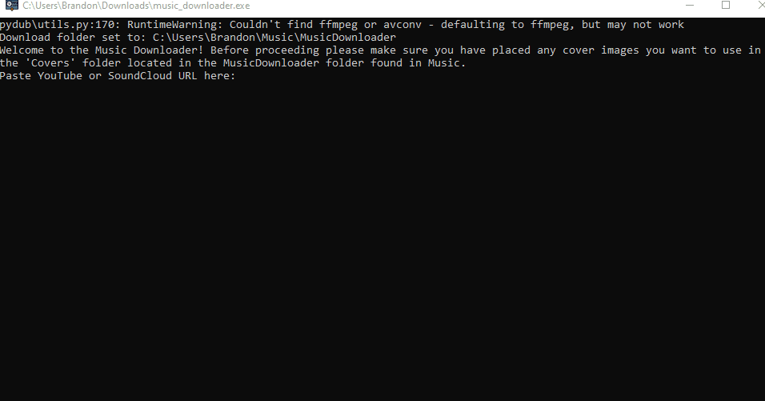

# Music Downloader
Created by: https://github.com/mpremach
A Python program to download music from YouTube or SoundCloud, convert it to MP3, add metadata, and optionally attach album covers.

# Features

- Download audio from YouTube or SoundCloud.
- Convert downloaded audio to MP3 using `pydub`.
- Add metadata: title, artist, album, year.
- Choose an album cover from a `Covers` folder.
- Works on Windows (requires `ffmpeg`).

# Setup
This program also requires ffmpeg, see download intructions below.

For new users upon installation the program must be ran at least once to create the required folders. After inital run program can be used freely. If you wish to use covers make sure to add images to the covers folder before converting music to see the cover options. 

If you wish to make changes and rebundle as .exe use 
Bundle as .exe (pyinstaller --onefile --noconsole --add-data "ffmpeg;ffmpeg" --icon="downloading.ico" music_downloader.py)

# ffmpeg
FFmpeg Requirement (Windows)
This program requires FFmpeg to convert audio files.

Go to the FFmpeg builds page: https://www.gyan.dev/ffmpeg/builds/

Download the "essentials" zip: Scroll down to the "release builds" section and download the ffmpeg-release-essentials.zip file.

Extract the files: Unzip the file you just downloaded.

Create the ffmpeg folder: In the same folder as this program (e.g., MusicDownloader), create a new folder and name it exactly: ffmpeg

Copy the tools:

Go into the unzipped folder (it will be named something like ffmpeg-X.X-essentials_build).

Go into the bin folder.

Copy the ffmpeg.exe and ffprobe.exe files.

Paste the tools: Paste ffmpeg.exe and ffprobe.exe into the ffmpeg folder you created earlier.

IMPORTANT: With how youtube works its possible the downloader stops working with youtube links, if this happens and you want to temporarily fix the issue yourself.
1. Clone repository to local machine
2. Open a terminal in this project folder
3. Run virtual enviornment (.\.venv\Scripts\activate)
4. pip install -r requirements.txt
5. Update yt_dlp (pip install --upgrade yt-dlp)
6. Bundle as .exe (pyinstaller --onefile --noconsole --add-data "ffmpeg;ffmpeg" --icon="downloading.ico" music_downloader.py)
